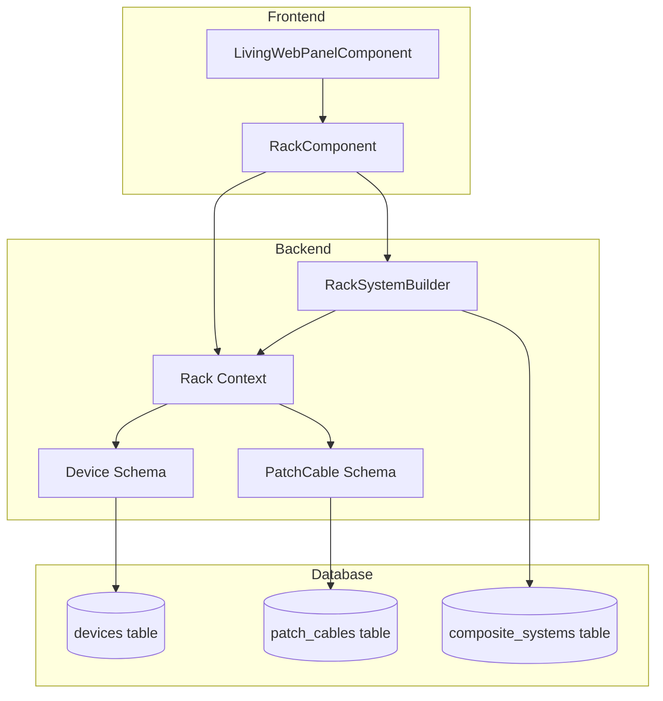

# Rack Architecture Status Report

## Overview
The "Rack Architecture" (formerly "Living Web") is a modular patching system that allows users to create and connect devices in a visual rack-style interface. This document tracks all changes made, future work, and next steps.

---

> **See also**: [RACK_ARCHITECTURE_RETROSPECTIVE.md](./RACK_ARCHITECTURE_RETROSPECTIVE.md) for a detailed history of the implementation steps and a guide for the planned rollback.

---

## Changes Completed

### Database Schema
- ✅ Created `devices` table with UUID primary keys
- ✅ Created `patch_cables` table for connections between devices
- ✅ Fixed foreign key type mismatches (UUID vs Integer)
- ✅ Added support for dynamic I/O configuration in `settings` JSONB field
- ✅ Updated `settings` default to use string keys for better persistence

### Backend (Ecto Schemas & Context)
- ✅ Created `GreenManTavern.Rack.Device` schema
- ✅ Created `GreenManTavern.Rack.PatchCable` schema
- ✅ Implemented `GreenManTavern.Rack` context with CRUD operations
- ✅ Updated `Device` schema to support dynamic inputs/outputs in settings
- ✅ Created `GreenManTavern.Rack.RackSystemBuilder` for composite system logic

### Frontend (LiveComponent)
- ✅ Created `RackComponent` LiveComponent
- ✅ Implemented sidebar with "Nodes" (Projects) and "My Systems" (Composite Systems)
- ✅ Implemented "Add Device" functionality
- ✅ Implemented patching interaction (click source jack → click target jack)
- ✅ Implemented SVG cable rendering with Bezier curves
- ✅ Implemented device editing modal:
  - Rename devices
  - Add/remove/rename input ports
  - Add/remove/rename output ports
- ✅ Implemented device selection UI (checkboxes)
- ✅ Added "Save as System" button and modal
- ✅ Implemented "Composite System" creation logic:
  - Collapses selected devices into a single "System" device
  - Preserves external connections
  - Saves the system to the library (`CompositeSystem` record) for reuse
- ✅ Made rack width responsive for dual-panel layout
- ✅ Refactored `LivingWebPanelComponent` to wrap `RackComponent`

### Refinement & UX (New)
- ✅ **Layout**: Implemented horizontal flex layout with wrapping.
- ✅ **Compact Design**: Reduced device size to `w-80` (320px).
- ✅ **Icons**: Added icon support (emojis) to devices.
- ✅ **Visuals**: Improved cable rendering to look like "guitar leads" (hanging slack).
- ✅ **Toolbar**: Added "Delete" and "Minimize" (placeholder) buttons.
- ✅ **Library**: Moved "My Systems" to the top of the sidebar.
- ✅ **Bug Fix**: Fixed persistence issue where device settings (renames/ports) were lost after multiple edits.

### Corrections (Latest)
- ✅ **Strict Grid**: Switched to 3-column CSS Grid with fixed container width (900px) for perfect cable alignment.
- ✅ **Port Layout**: Moved Inputs to Top and Outputs to Bottom.
- ✅ **Persistence Hardening**: Rewrote `save_device` to explicitly normalize keys and ensure robust saving.
- ✅ **Cable Aesthetics**: Tuned slack and added realistic cable colors.

### Failed Experiments
- ❌ **Infinite Rack**: Attempted to implement an infinite pan/zoom canvas with drag-and-drop. Reverted due to user dissatisfaction with visual changes ("black background") and complexity ("haywire"). Restored Strict Grid layout.

**Files**:
- [rack_component.ex](file:///home/jesse/Projects/HyperArk-2025-antigravity/lib/green_man_tavern_web/live/components/rack_component.ex)
- [living_web_panel_component.ex](file:///home/jesse/Projects/HyperArk-2025-antigravity/lib/green_man_tavern_web/live/components/living_web_panel_component.ex)

---

## Future Changes (Planned)

### Cable Management
- 🔲 **Delete cables**: Right-click or button to remove patch cables
- 🔲 **Cable colors**: Allow user to customize cable colors
- 🔲 **Visual feedback during patching**: Show "ghost" cable following cursor

### Device Management
- 🔲 **Drag-and-drop reordering**: Allow users to reorder devices in the rack
- 🔲 **Duplicate devices**: Clone a device with same settings
- 🔲 **Minimize Logic**: Implement actual minimization of devices.

### Composite System Expansion
- 🔲 **"Expand System" feature**: Convert composite device back to individual devices
- 🔲 **Edit internal structure**: Allow editing the internal graph of a composite system

### Data Persistence & Loading
- 🔲 **User-specific racks**: Filter devices by user_id
- 🔲 **Multiple racks**: Allow users to have multiple rack configurations
- 🔲 **Auto-save**: Persist changes automatically

### Testing
- 🔲 **Unit tests** for `Rack` context functions
- 🔲 **Unit tests** for `RackSystemBuilder`
- 🔲 **LiveView tests** for `RackComponent` interactions

---

## Next Steps (Prioritized)

### Immediate (This Session)
1. **Verify UX**: Ensure the new layout and cable rendering feel good.
2. **Implement Cable Deletion**: Add a way to remove cables.

### Short-term (Next Session)
3. **Improve Visual Feedback**: Add ghost cable during patching.
4. **Add Device Drag-and-Drop**: Implement reordering.

### Medium-term (Future Sessions)
5. **User-specific Rack Management**: Filter by user.
6. **System Expansion**: Allow editing composite systems.

---

## Technical Debt & Known Issues

### Current Issues
- ⚠️ **Jack coordinate calculation**: Currently assumes a fixed 2-column grid for cable routing, which may not match the flex layout on all screen sizes.
- ⚠️ **Cable rendering performance**: May degrade with many cables. Consider virtualization.
- ⚠️ **No undo/redo**: Users cannot undo destructive actions.

### Design Decisions to Revisit
- 🤔 **Device deletion strategy**: Should we soft-delete or hard-delete when creating composites?
- 🤔 **Composite system storage**: Should we serialize internal devices in settings or keep them in DB?
- 🤔 **Multiple jacks with same ID**: Currently prevented, but may be needed for advanced use cases.

---

## Architecture Diagram

