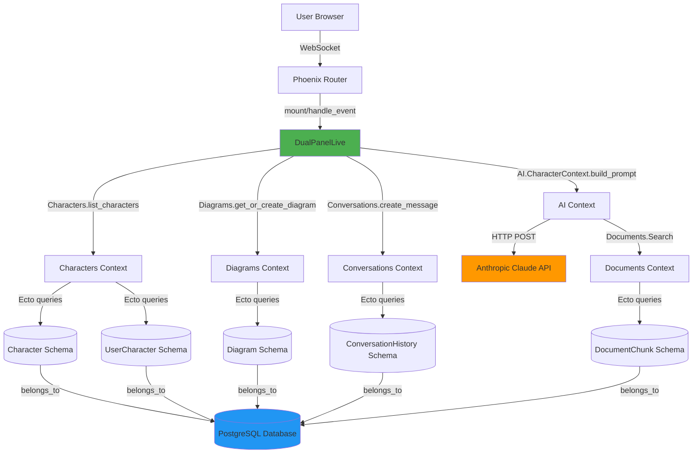
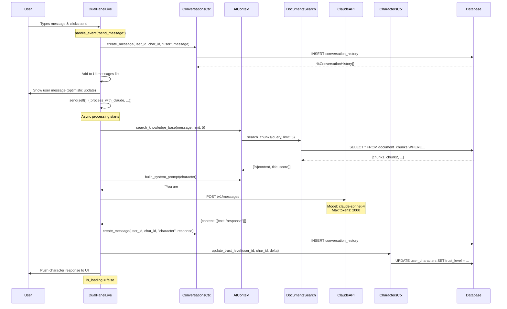
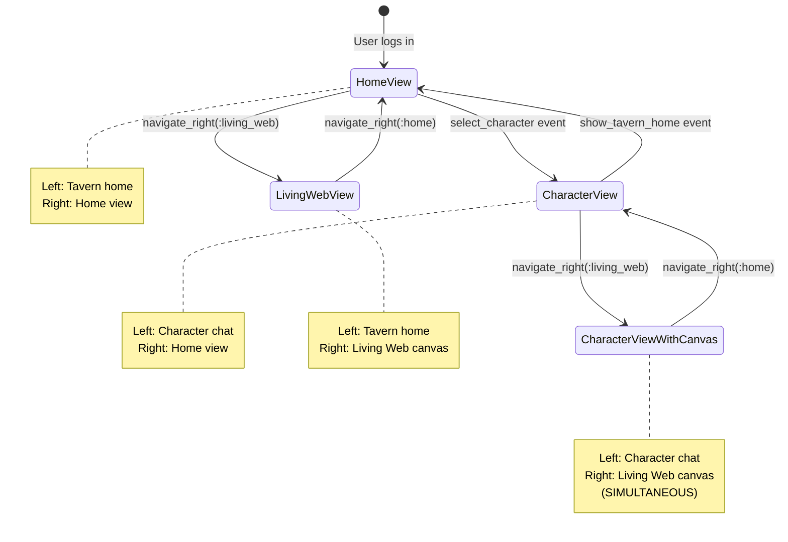
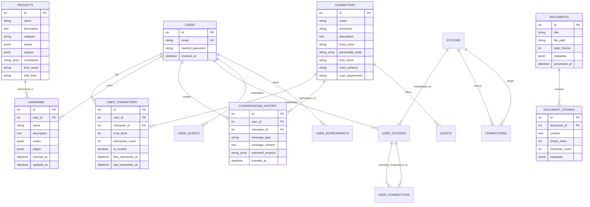
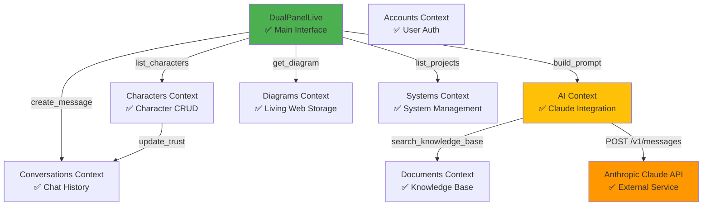
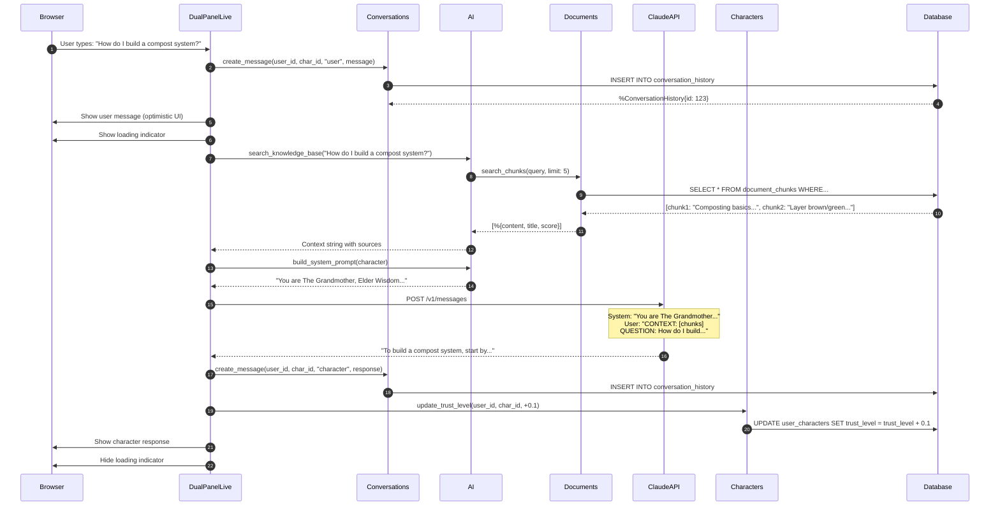
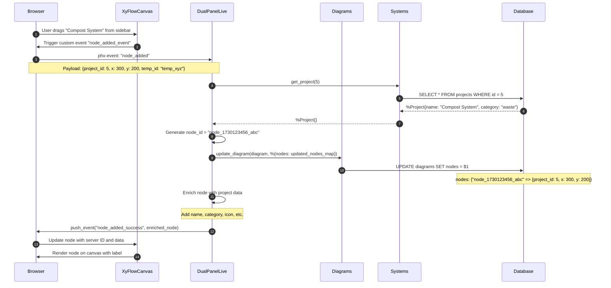

# Green Man Tavern - Architecture Diagram

> **Last Updated**: October 28, 2025
> **Status Legend**: ✅ Complete | 🚧 In Progress | 📋 Planned

---

## 1. System Overview

```
┌─────────────────────────────────────────────────────────────────────┐
│                     GREEN MAN TAVERN PLATFORM                        │
│                    Phoenix LiveView Application                      │
└─────────────────────────────────────────────────────────────────────┘
                                    │
        ┌───────────────────────────┼───────────────────────────┐
        │                           │                           │
   ┌────▼────┐                 ┌────▼────┐              ┌──────▼──────┐
   │  User   │                 │   AI    │              │  Living Web │
   │  Auth   │                 │Character│              │   System    │
   │         │                 │  Chat   │              │   Design    │
   └────┬────┘                 └────┬────┘              └──────┬──────┘
        │                           │                           │
   ✅ Complete                  ✅ Complete                 ✅ Complete
                                                          🚧 Polish needed
```

---

## 2. LiveView → Context → Schema Architecture

### 2.1 Request Flow Diagram



### 2.2 LiveView Routing Structure

```
lib/green_man_tavern_web/router.ex
│
├─ Public Routes (no auth)
│  ├─ POST /register → UserRegistrationLive ✅
│  ├─ POST /login → UserSessionLive ✅
│  └─ DELETE /logout ✅
│
└─ Authenticated Routes (on_mount: ensure_authenticated)
   ├─ GET / → DualPanelLive (:home) ✅
   │           │
   │           ├─ Left Panel: Character Selection
   │           └─ Right Panel: Living Web Canvas
   │
   └─ GET /living-web → DualPanelLive (:living_web) ✅
```

### 2.3 LiveView → Context Mapping Table

| LiveView | Primary Contexts Used | Purpose | Status |
|----------|----------------------|---------|--------|
| `DualPanelLive` | Characters, Diagrams, Conversations, AI, Systems | Main app interface | ✅ Complete |
| `CharacterLive` | Characters, Conversations, AI | Individual character chat | ✅ Complete (legacy) |
| `LivingWebLive` | Diagrams, Systems | System design canvas | ✅ Integrated into DualPanel |
| `UserSessionLive` | Accounts | Login | ✅ Complete |
| `UserRegistrationLive` | Accounts | Registration | ✅ Complete |
| `HomeLive` | Characters, Conversations | Original home page | 🚧 Deprecated, kept for reference |

---

## 3. AI Character Query Flow

### 3.1 Complete Message Processing Pipeline



### 3.2 AI Integration Components

```
lib/green_man_tavern/ai/
│
├─ claude_client.ex ✅
│  └─ Functions:
│     ├─ chat(message, system_prompt, context) → HTTP POST
│     ├─ parse_response(body) → Extract text from JSON
│     └─ Error handling with fallback messages
│
└─ character_context.ex ✅
   └─ Functions:
      ├─ build_system_prompt(character)
      │  ├─ Character name, archetype, description
      │  ├─ Focus area (e.g., "Traditional Methods")
      │  ├─ Personality traits (formatted list)
      │  └─ Role & behavior instructions
      │
      └─ search_knowledge_base(query, opts)
         ├─ Call Documents.Search.search_chunks()
         ├─ Format results with [Source: title]
         └─ Return context string for Claude
```

### 3.3 Knowledge Base Search Pipeline

```
User Query: "How do I build a compost system?"
    │
    ▼
Documents.Search.search_chunks(query, limit: 5)
    │
    ├─ Extract keywords: ["build", "compost", "system"]
    │  (Remove stop words: "how", "do", "I", "a")
    │
    ├─ SQL Query:
    │  SELECT * FROM document_chunks
    │  WHERE content ILIKE '%build%'
    │     OR content ILIKE '%compost%'
    │     OR content ILIKE '%system%'
    │  AND character_count >= 100
    │  ORDER BY relevance_score DESC
    │  LIMIT 5
    │
    └─ Return:
       [
         %{content: "...", title: "Composting Guide", score: 0.85},
         %{content: "...", title: "Waste Systems", score: 0.72},
         ...
       ]

Status: ✅ Working (keyword-based)
Future: 📋 Vector embeddings with pgvector
```

### 3.4 Trust Level Calculation

```elixir
# Location: lib/green_man_tavern_web/live/dual_panel_live.ex:416-426
# Status: ✅ Working, 🚧 Simple algorithm

defp calculate_trust_delta(user_message, character_response) do
  message_length = String.length(user_message)
  response_length = String.length(character_response)

  cond do
    message_length > 50 and response_length > 100 -> 0.1  # Substantial conversation
    message_length > 20 and response_length > 50 -> 0.05  # Moderate engagement
    true -> 0.01  # Basic interaction
  end
end

# Future Enhancement: 📋
# - Sentiment analysis
# - Question complexity scoring
# - User satisfaction ratings
# - Time spent in conversation
```

---

## 4. Dual-Panel Layout Structure

### 4.1 Visual Layout Architecture

```
┌──────────────────────────────────────────────────────────────────────┐
│                        Browser Window                                 │
│  ┌────────────────────────────────────────────────────────────────┐  │
│  │                     Top Navigation Bar                          │  │
│  │  [Green Man Tavern Logo]    [Living Web]    [User: jesse] [▼]  │  │
│  └────────────────────────────────────────────────────────────────┘  │
│                                                                       │
│  ┌─────────────────────────┬─────────────────────────────────────┐  │
│  │      LEFT PANEL         │         RIGHT PANEL                 │  │
│  │   (Character Zone)      │      (Living Web Zone)              │  │
│  │                         │                                     │  │
│  │  ┌──────────────────┐   │   ┌──────────────────────────────┐ │  │
│  │  │ Tavern Home      │   │   │  Living Web Canvas           │ │  │
│  │  │ or               │   │   │  or                          │ │  │
│  │  │ Character Chat   │   │   │  Home View                   │ │  │
│  │  └──────────────────┘   │   └──────────────────────────────┘ │  │
│  │                         │                                     │  │
│  └─────────────────────────┴─────────────────────────────────────┘  │
└──────────────────────────────────────────────────────────────────────┘

Status: ✅ Complete (Commit 5360ffa - Oct 28, 2025)
```

### 4.2 State Management in DualPanelLive

```elixir
# lib/green_man_tavern_web/live/dual_panel_live.ex

socket.assigns = %{
  # User & Auth
  current_user: %User{},           # ✅ From on_mount hook

  # Left Panel State
  view_mode: :home | :character,   # ✅ Toggle between tavern/character
  selected_character: %Character{} | nil,  # ✅ Currently selected character
  characters: [%Character{}],      # ✅ All available characters
  chat_messages: [%{}],            # ✅ Current conversation messages
  is_loading: boolean,             # ✅ Character response pending
  user_message: "",                # ✅ Form input binding

  # Right Panel State
  right_panel_view: :home | :living_web,  # ✅ Toggle canvas/home
  diagram: %Diagram{},             # ✅ Current user's diagram
  available_projects: [%Project{}], # ✅ System templates

  # Trust & Relationships
  user_characters: [%UserCharacter{}],  # ✅ Trust tracking

  # PubSub Topics
  # - "user:#{user_id}:characters" (character updates)
  # - "user:#{user_id}:diagrams" (diagram updates)
}
```

### 4.3 Panel Navigation Events



### 4.4 Key Event Handlers

| Event | Handler Location | Purpose | Status |
|-------|-----------------|---------|--------|
| `select_character` | `dual_panel_live.ex:113` | Switch to character chat | ✅ |
| `show_tavern_home` | `dual_panel_live.ex:135` | Return to home | ✅ |
| `navigate_right` | `dual_panel_live.ex:142` | Toggle right panel | ✅ |
| `send_message` | `dual_panel_live.ex:163` | Send chat message | ✅ |
| `node_added` | `dual_panel_live.ex:306` | Add system to canvas | ✅ |
| `node_moved` | `dual_panel_live.ex:348` | Update node position | ✅ |
| `edge_added` | `dual_panel_live.ex:376` | Connect systems | ✅ |

---

## 5. Database Schema & Relationships

### 5.1 Entity Relationship Diagram



### 5.2 Schema Status Table

| Schema | File Path | Relationships | Status |
|--------|-----------|---------------|--------|
| **User** | `lib/green_man_tavern/accounts/user.ex` | has_many :user_characters, :diagrams, :conversations | ✅ Complete |
| **Character** | `lib/green_man_tavern/characters/character.ex` | has_many :user_characters, :conversations, :quests | ✅ Complete |
| **UserCharacter** | `lib/green_man_tavern/characters/user_character.ex` | belongs_to :user, :character | ✅ Complete |
| **ConversationHistory** | `lib/green_man_tavern/conversations/conversation_history.ex` | belongs_to :user, :character | ✅ Complete |
| **Diagram** | `lib/green_man_tavern/diagrams/diagram.ex` | belongs_to :user | ✅ Complete |
| **Project** | `lib/green_man_tavern/systems/project.ex` | (templates, no direct FK) | ✅ Complete |
| **System** | `lib/green_man_tavern/systems/system.ex` | has_many :user_systems, :connections | ✅ Complete, 🚧 Minimal UI |
| **UserSystem** | `lib/green_man_tavern/systems/user_system.ex` | belongs_to :user, :system | ✅ Complete, 🚧 Minimal UI |
| **Connection** | `lib/green_man_tavern/systems/connection.ex` | belongs_to :source_system, :target_system | ✅ Complete, 🚧 Minimal UI |
| **UserConnection** | `lib/green_man_tavern/systems/user_connection.ex` | belongs_to :user, :source_user_system, :target_user_system | ✅ Complete, 🚧 Minimal UI |
| **Document** | `lib/green_man_tavern/documents/document.ex` | has_many :chunks | ✅ Complete |
| **DocumentChunk** | `lib/green_man_tavern/documents/document_chunk.ex` | belongs_to :document | ✅ Complete |
| **Quest** | `lib/green_man_tavern/quests/quest.ex` | belongs_to :character, has_many :user_quests | ✅ Schema, 📋 No UI |
| **UserQuest** | `lib/green_man_tavern/quests/user_quest.ex` | belongs_to :user, :quest | ✅ Schema, 📋 No UI |
| **Achievement** | `lib/green_man_tavern/achievements/achievement.ex` | has_many :user_achievements | ✅ Schema, 📋 No UI |
| **UserAchievement** | `lib/green_man_tavern/achievements/user_achievement.ex` | belongs_to :user, :achievement | ✅ Schema, 📋 No UI |

### 5.3 Key Database Constraints

```sql
-- User Characters (Trust Tracking)
ALTER TABLE user_characters
  ADD CONSTRAINT fk_user FOREIGN KEY (user_id) REFERENCES users(id) ON DELETE CASCADE,
  ADD CONSTRAINT fk_character FOREIGN KEY (character_id) REFERENCES characters(id) ON DELETE CASCADE,
  ADD CONSTRAINT unique_user_character UNIQUE (user_id, character_id);
  -- Status: ✅ Enforced

-- Conversation History (User-Scoped)
ALTER TABLE conversation_history
  ADD CONSTRAINT fk_user FOREIGN KEY (user_id) REFERENCES users(id) ON DELETE CASCADE,
  ADD CONSTRAINT fk_character FOREIGN KEY (character_id) REFERENCES characters(id) ON DELETE CASCADE;
  -- Status: ✅ Enforced
  -- All queries automatically scoped by user_id

-- Document Chunks (Cascade Delete)
ALTER TABLE document_chunks
  ADD CONSTRAINT fk_document FOREIGN KEY (document_id) REFERENCES documents(id) ON DELETE CASCADE;
  -- Status: ✅ Enforced

-- Diagrams (User-Scoped)
ALTER TABLE diagrams
  ADD CONSTRAINT fk_user FOREIGN KEY (user_id) REFERENCES users(id) ON DELETE CASCADE;
  -- Status: ✅ Enforced
```

---

## 6. Module Integration Points

### 6.1 Context Dependency Graph



### 6.2 Cross-Module Communication

| From Module | To Module | Integration Point | Purpose | Status |
|-------------|-----------|-------------------|---------|--------|
| **AI Context** | **Documents Context** | `search_knowledge_base/2` | RAG for character responses | ✅ |
| **AI Context** | **Claude API** | `chat/3` | Get AI responses | ✅ |
| **Characters Context** | **Conversations Context** | `update_trust_level/4` | Track interaction quality | ✅ |
| **DualPanelLive** | **All Contexts** | Direct function calls | Orchestrate business logic | ✅ |
| **Diagrams Context** | **Systems Context** | Project template lookup | Enrich nodes with project data | ✅ |
| **User Auth** | **All Contexts** | `user_id` parameter | User-scoped queries | ✅ |

### 6.3 PubSub Topics (Real-time Updates)

```elixir
# Location: lib/green_man_tavern_web/live/dual_panel_live.ex:48-51

Phoenix.PubSub.subscribe(GreenManTavern.PubSub, "user:#{user_id}:characters")
Phoenix.PubSub.subscribe(GreenManTavern.PubSub, "user:#{user_id}:diagrams")

# Broadcast events:
# - character_trust_updated
# - diagram_updated
# - new_achievement_unlocked (future)

# Status: ✅ Infrastructure ready, 🚧 Minimal usage
```

### 6.4 External Service Integrations

```
┌─────────────────────────────────────────────────────────────┐
│                   Green Man Tavern App                       │
└──────────────────┬──────────────────────────────────────────┘
                   │
       ┌───────────┼───────────────┐
       │                           │
   ┌───▼────┐                 ┌────▼─────┐
   │ Claude │                 │PostgreSQL│
   │  API   │                 │ Database │
   │        │                 │          │
   └────────┘                 └──────────┘

   ✅ Complete                ✅ Complete

   Endpoint:                  Local:
   api.anthropic.com          localhost:5432

   Model:                     Version:
   claude-sonnet-4            PostgreSQL 14+

   Config:                    Features:
   ANTHROPIC_API_KEY          - JSONB support
   (env variable)             - Full-text search
                              - Indexes on FKs

   Future: 📋
   - Vector embeddings
     (pgvector extension)
```

---

## 7. Data Flow: Complete User Journey

### 7.1 User Chats with Character about Permaculture



### 7.2 User Designs System in Living Web



---

## 8. Security Architecture

### 8.1 Authentication & Authorization Flow

```
User Login Request
    ↓
Accounts.authenticate_user(email, password)
    ↓
Argon2.verify_pass(password, hashed_password) ✅
    ↓
Phoenix.Token.sign(conn, "user session", user_id) ✅
    ↓
Set HTTPOnly Cookie (expires: 60 days) ✅
    ↓
All LiveView requests include session token
    ↓
on_mount(:ensure_authenticated) hook
    ↓
Phoenix.Token.verify(socket, "user session", token, max_age: 60 days) ✅
    ↓
If valid: Load user, assign to socket
If invalid: Redirect to /login
    ↓
All context calls include user_id parameter
    ↓
Ecto queries automatically scope by user_id ✅
```

### 8.2 Security Features Checklist

| Feature | Implementation | Location | Status |
|---------|---------------|----------|--------|
| Password Hashing | Argon2 (via Comeonin) | `user.ex` changeset | ✅ |
| Session Tokens | Phoenix.Token (signed) | `router.ex` on_mount | ✅ |
| CSRF Protection | Phoenix built-in | `endpoint.ex` | ✅ |
| XSS Prevention | Phoenix.HTML.html_escape | All templates | ✅ |
| User-Scoped Queries | Ecto `where(user_id: ^user_id)` | All contexts | ✅ |
| HTTPOnly Cookies | `http_only: true` | `endpoint.ex` | ✅ |
| SameSite Policy | `same_site: "Lax"` | `endpoint.ex` | ✅ |
| API Key Security | Environment variable | `config/runtime.exs` | ✅ |
| SQL Injection Prevention | Ecto parameterized queries | All schemas | ✅ |
| Rate Limiting | - | - | 📋 Planned |

---

## 9. Performance Optimizations

### 9.1 Database Indexes

```sql
-- Automatically created by Ecto migrations ✅

CREATE INDEX idx_user_characters_user_id ON user_characters(user_id);
CREATE INDEX idx_user_characters_character_id ON user_characters(character_id);
CREATE INDEX idx_conversation_history_user_id ON conversation_history(user_id);
CREATE INDEX idx_conversation_history_character_id ON conversation_history(character_id);
CREATE INDEX idx_diagrams_user_id ON diagrams(user_id);
CREATE INDEX idx_document_chunks_document_id ON document_chunks(document_id);

-- Recommended additions: 📋
CREATE INDEX idx_document_chunks_content_gin ON document_chunks USING gin(to_tsvector('english', content));
-- (Full-text search performance)

CREATE INDEX idx_conversation_history_inserted_at ON conversation_history(user_id, inserted_at DESC);
-- (Faster conversation history loading)
```

### 9.2 LiveView Performance Patterns

| Pattern | Implementation | Benefit | Status |
|---------|---------------|---------|--------|
| **Async Processing** | `send(self(), {:process_with_claude, ...})` | Non-blocking AI calls | ✅ |
| **Optimistic Updates** | Add user message to UI before DB insert | Feels instant | ✅ |
| **Targeted Updates** | `push_event` for specific DOM changes | Minimal re-render | ✅ |
| **PubSub** | Subscribe to user-specific topics | Real-time without polling | ✅ |
| **Pagination** | `LIMIT 20` on conversations | Fast initial load | 🚧 Partial |
| **Debouncing** | Input delay before search | Reduce API calls | 📋 Planned |
| **Caching** | - | Reduce DB queries | 📋 Planned |

---

## 10. Testing Strategy

### 10.1 Test Coverage (Current State)

```
test/
├─ green_man_tavern/
│  ├─ accounts_test.exs         🚧 Basic tests
│  ├─ characters_test.exs       📋 Needs expansion
│  ├─ conversations_test.exs    📋 Needs expansion
│  ├─ documents_test.exs        📋 Needs expansion
│  └─ ai/
│     └─ claude_client_test.exs 📋 Needs mocking
│
└─ green_man_tavern_web/
   ├─ live/
   │  └─ dual_panel_live_test.exs 📋 Minimal coverage
   └─ controllers/
      └─ page_controller_test.exs ✅ Basic

Estimated Coverage: ~15-20%
Recommended Target: 70-80%
```

### 10.2 Priority Test Areas

| Area | Test Type | Priority | Reason |
|------|-----------|----------|--------|
| **User Authentication** | Integration | HIGH | Security critical |
| **User-Scoped Queries** | Unit | HIGH | Prevent data leaks |
| **Claude API Client** | Unit (mocked) | HIGH | External dependency |
| **Knowledge Base Search** | Unit | MEDIUM | Core feature |
| **Trust Calculation** | Unit | MEDIUM | Business logic |
| **Diagram Persistence** | Integration | MEDIUM | Data integrity |
| **Character Context Building** | Unit | LOW | Simple logic |

---

## 11. Deployment Architecture

### 11.1 Current Setup

```
Development Environment (Current)
┌─────────────────────────────────────┐
│  Local Machine (localhost:4000)     │
│  ┌─────────────────────────────┐    │
│  │  Phoenix Server              │    │
│  │  - mix phx.server            │    │
│  │  - LiveView WebSocket        │    │
│  └─────────────────────────────┘    │
│  ┌─────────────────────────────┐    │
│  │  PostgreSQL                  │    │
│  │  - localhost:5432            │    │
│  └─────────────────────────────┘    │
└─────────────────────────────────────┘
         │
         ├─ External: Anthropic Claude API
         └─ Assets: esbuild, tailwind (watch mode)

Status: ✅ Working
```

### 11.2 Production Deployment (Recommended)

```
Production Environment (Suggested)
┌─────────────────────────────────────────────────┐
│  Cloud Provider (Fly.io / Render / Railway)     │
│  ┌───────────────────────────────────────────┐  │
│  │  Phoenix App (Containerized)              │  │
│  │  - Release build (mix release)            │  │
│  │  - Multiple instances (horizontal scale)  │  │
│  │  - Health checks                          │  │
│  └───────────────────────────────────────────┘  │
│  ┌───────────────────────────────────────────┐  │
│  │  PostgreSQL (Managed)                     │  │
│  │  - Automatic backups                      │  │
│  │  - Connection pooling                     │  │
│  └───────────────────────────────────────────┘  │
│  ┌───────────────────────────────────────────┐  │
│  │  CDN (Static Assets)                      │  │
│  │  - Compiled JS/CSS                        │  │
│  │  - Image assets                           │  │
│  └───────────────────────────────────────────┘  │
└─────────────────────────────────────────────────┘
         │
         └─ External: Anthropic Claude API (HTTPS)

Required Env Vars:
  - SECRET_KEY_BASE
  - DATABASE_URL
  - ANTHROPIC_API_KEY
  - PHX_HOST

Status: 📋 Planned
```

---

## 12. Future Enhancements

### 12.1 Roadmap

| Feature | Description | Priority | Dependencies | Status |
|---------|-------------|----------|--------------|--------|
| **Vector Embeddings** | Semantic search with pgvector | HIGH | pgvector extension, Claude embeddings API | 📋 |
| **Multi-Character Debates** | Group conversations between characters | MEDIUM | Enhanced AI context management | 📋 |
| **System Validation** | AI analyzes Living Web designs for issues | MEDIUM | Claude function calling | 📋 |
| **Gamification UI** | Quests, achievements, progress tracking | LOW | Frontend design work | 📋 |
| **PDF Upload** | Users upload their own documents | MEDIUM | File storage (S3), processing queue | 📋 |
| **Mobile App** | React Native or Flutter | LOW | API endpoints, auth tokens | 📋 |
| **Analytics Dashboard** | User engagement metrics | LOW | Time-series database | 📋 |
| **Community Features** | Share designs, comment on systems | MEDIUM | Social features, moderation | 📋 |

### 12.2 Technical Debt Items

| Item | Impact | Effort | Priority |
|------|--------|--------|----------|
| Remove debug logging | Cleaner console, security | 30 mins | HIGH |
| Fix Tailwind CSS v4 | Maintainable styling | 1-2 hours | HIGH |
| Improve trust algorithm | Better engagement metrics | 2-3 hours | MEDIUM |
| Add comprehensive tests | Prevent regressions | 5-10 hours | MEDIUM |
| Implement rate limiting | Prevent API abuse | 2-3 hours | MEDIUM |
| Add error tracking | Better debugging | 1 hour | LOW |

---

## 13. Key File Reference

### 13.1 Critical Files by Layer

**LiveViews (Presentation)**
- `lib/green_man_tavern_web/live/dual_panel_live.ex:1-451` ✅ Main app interface
- `lib/green_man_tavern_web/live/character_live.ex:1-320` ✅ Legacy character view
- `lib/green_man_tavern_web/live/user_session_live.ex:1-134` ✅ Login
- `lib/green_man_tavern_web/live/user_registration_live.ex:1-129` ✅ Registration

**Contexts (Business Logic)**
- `lib/green_man_tavern/characters.ex` ✅ Character management
- `lib/green_man_tavern/conversations.ex` ✅ Chat history
- `lib/green_man_tavern/diagrams.ex` ✅ Living Web persistence
- `lib/green_man_tavern/documents.ex` ✅ Knowledge base
- `lib/green_man_tavern/accounts.ex` ✅ User auth

**AI Integration**
- `lib/green_man_tavern/ai/claude_client.ex:1-80` ✅ API client
- `lib/green_man_tavern/ai/character_context.ex:1-120` ✅ Prompt building

**Schemas (Data)**
- `lib/green_man_tavern/accounts/user.ex` ✅ User model
- `lib/green_man_tavern/characters/character.ex` ✅ Character model
- `lib/green_man_tavern/conversations/conversation_history.ex` ✅ Message model
- `lib/green_man_tavern/diagrams/diagram.ex` ✅ Diagram model

**Configuration**
- `config/config.exs` ✅ Application config
- `config/runtime.exs` ✅ Runtime env (API keys)
- `lib/green_man_tavern_web/router.ex` ✅ Routes

**Database**
- `priv/repo/migrations/` ✅ 23 migration files
- `priv/repo/seeds/` ✅ Characters, projects, systems

---

## 14. Summary: Overall System Health

| Component | Completeness | Quality | Notes |
|-----------|--------------|---------|-------|
| **Authentication** | 100% | 9/10 | ✅ Secure, production-ready |
| **Character AI** | 100% | 9/10 | ✅ Robust, async, good error handling |
| **Chat Interface** | 95% | 8/10 | ✅ Working, 🚧 polish needed |
| **Living Web** | 90% | 7/10 | ✅ Functional, 🚧 debug logging, CSS issues |
| **Knowledge Base** | 80% | 7/10 | ✅ Working, 📋 needs embeddings |
| **Database Schema** | 100% | 8/10 | ✅ Well-designed, normalized |
| **Testing** | 15% | 5/10 | 🚧 Needs significant expansion |
| **Documentation** | 60% | 7/10 | ✅ Code readable, 🚧 sparse inline docs |

**Overall Assessment**: The Green Man Tavern is a well-architected, feature-rich platform with solid fundamentals. The dual-panel architecture and Claude integration are production-ready. Main focus areas:
1. **Immediate**: Remove debug logging, fix Tailwind CSS
2. **Short-term**: Add tests, implement vector embeddings
3. **Long-term**: Gamification UI, advanced AI features

---

*This architecture diagram is current as of October 28, 2025. For updates, see git history.*
